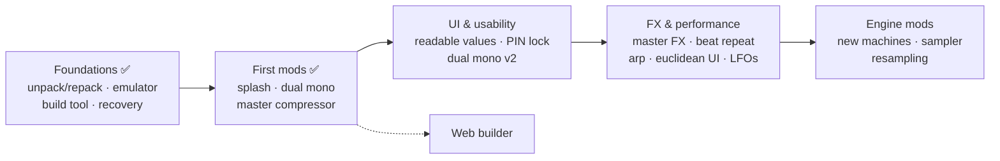

# SyntHack OS

Unofficial, modular firmware mods for the **Elektron Syntakt** (OS 1.41).
Each mod is a small patch applied to the stock OS you download from elektron.se — no firmware is distributed here.

> **Not affiliated with Elektron.** Modified firmware can make your device unusable and may void your warranty.
> Learn the [recovery procedure](RECOVERY.md) before flashing. Use at your own risk.

**Status:** `v0.4.3` — four mods running on real hardware.

## Features

| Feature | Status | What it does |
|---|---|---|
| [Master compressor](mods/master-comp) | ✅ v0.4.3 | Bus compressor on the **analog master** (via the master VCAs). Digitakt-style curves. THR · ATK · REL · MUP · RAT (OFF, 1.5:1 … 20:1) + live gain-reduction meter on the FX track SYN page. Saved per pattern, or global with *SYN global*. |
| [Dual mono input](mods/dual-mono) | ✅ v0.4.3 | With EXTERNAL IN set to mono, **IN L** and **IN R** get independent levels on the External Mixer page. |
| [Boot splash](mods/splash) | ✅ v0.4.3 | "SyntHack v0.4.3" logo after the official intro. Boot time unchanged. |
| [Mod area](mods/modarea) | ✅ infra | 32 KB of RAM for mod code, loaded at boot. |
| Readable parameter values | ⬜ planned | Show real units: ms for attack/release, Hz for cutoff, dB for gain… |
| PIN lock | ⬜ planned | Optional PIN at power-on, as a theft deterrent. Recovery via OS reflash stays possible. |
| Dual mono v2 | ⬜ planned | Separate IN L / IN R pages with their own FX sends. |
| New LFO shapes · 3rd LFO / mod matrix | ⬜ planned | |
| Master FX suite · beat repeat | ⬜ planned | |
| Arpeggiator · Euclidean circle UI | ⬜ planned | |
| Resampling to SP TWINSHOT · advanced sampler | ⬜ planned | |
| New machines: RISER / DOWNFILTER, SY SWARM+ | ⬜ planned | Requires custom audio-engine code (CPU #2). |
| Web builder | ⬜ planned | Pick mods in the browser, build your `.syx` locally. |

## Roadmap



## How it works

- `tools/unpack` — unpack/repack the `.syx` (wraps [elektron-firmware-tool](https://github.com/mischa85/elektron-firmware-tool)).
- `mods/<name>/patch.json` — *where* to patch, a hash of the expected original bytes, and **our** new bytes.
- `tools/build/build.py` — stock OS + chosen mods → verified `.syx` (refuses wrong OS, overlaps, protected sections).
- `tools/emu` — ColdFire emulator (Unicorn + our EMAC model). Every mod is tested against the original code before flashing.

Technical findings: [docs/](docs).

## Build your OS

Requires Python 3, WSL/Linux and your own `Syntakt_OS1.41.syx` (see [firmware/README.md](firmware/README.md)).

```sh
bash tools/unpack/setup_eft.sh                 # once (WSL/Linux)
git config core.hooksPath tools/hooks          # once: blocks firmware files from commits
python tools/build/build.py --stock firmware/Syntakt_OS1.41.syx \
    mods/splash mods/dual-mono mods/modarea mods/master-comp -o out/synthack.syx
```

Flash `out/synthack.syx` with Elektron Transfer (USB, *Drop* page). To go back, flash the stock OS the same way.

## Contributing

Issues and pull requests are welcome — see [CONTRIBUTING.md](CONTRIBUTING.md).
Please don't post mods or instructions on Elektronauts (forbidden there); use GitHub.

## License

MIT for everything in this repository ([LICENSE](LICENSE)). See [LEGAL.md](LEGAL.md).
